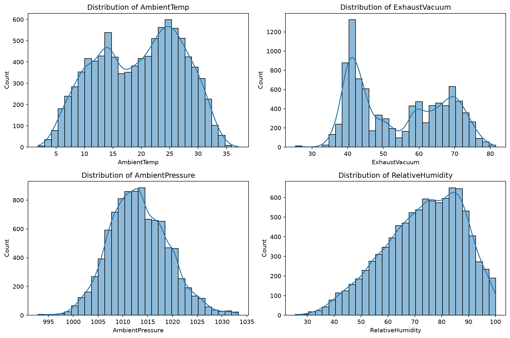
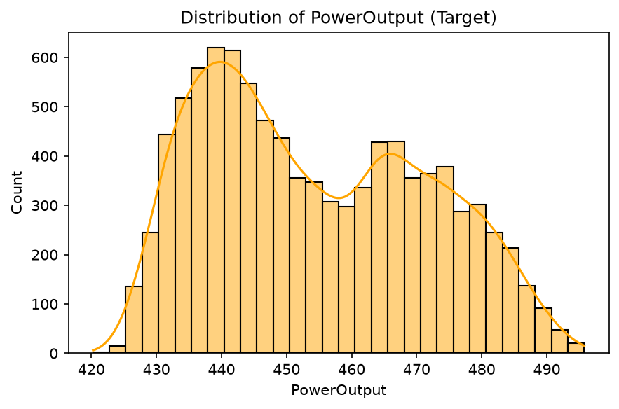
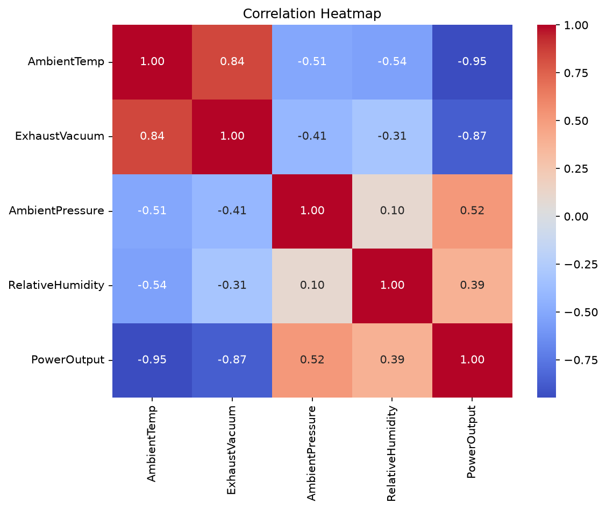
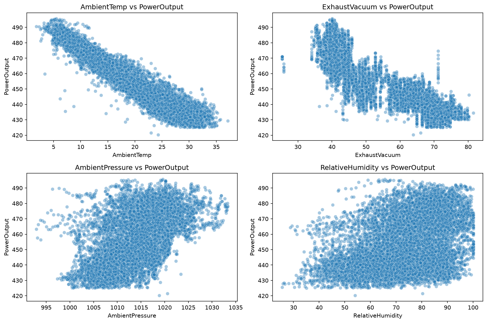
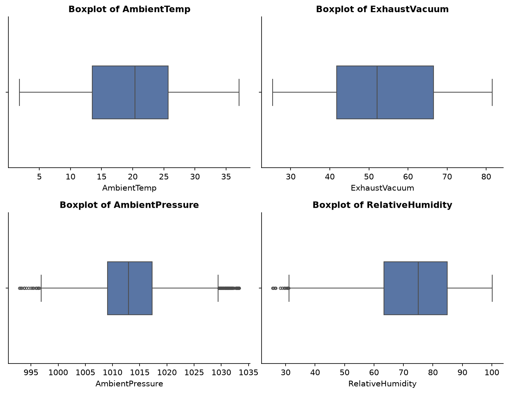
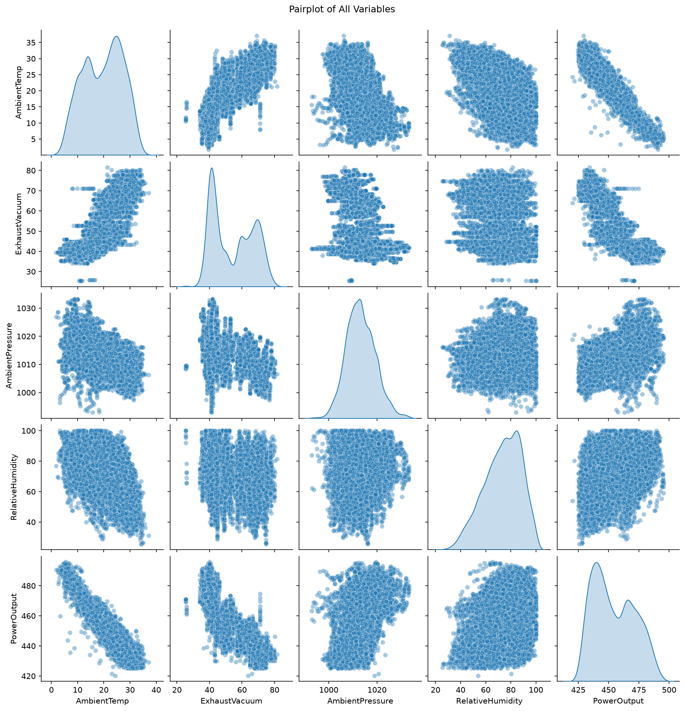
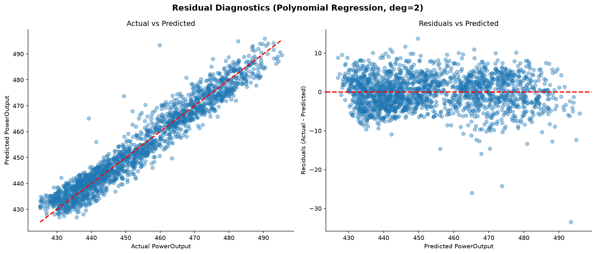
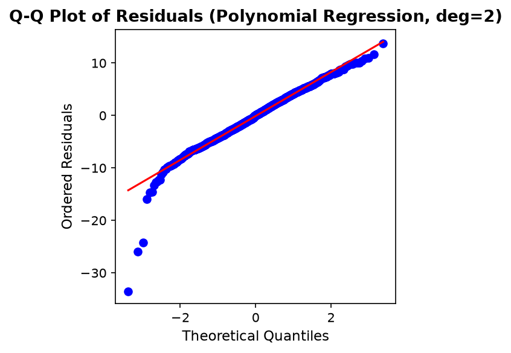
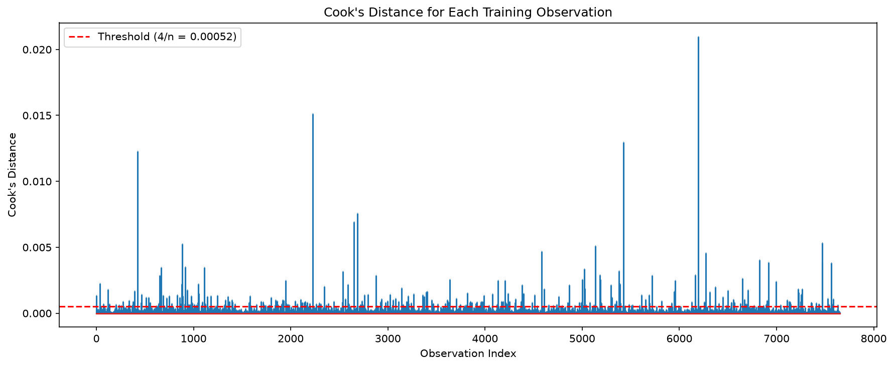
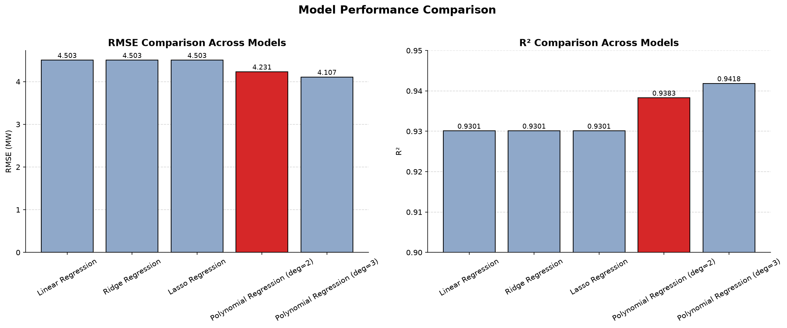

# Power Plant Energy Output Prediction

Regression-based prediction of net hourly electrical energy output for a Combined Cycle Power Plant, using ambient sensor readings.

---

## Table of Contents

- [Problem Statement](#problem-statement)
- [Dataset](#dataset)
- [Approach & EDA Highlights](#approach--eda-highlights)
- [Key Findings](#key-findings)
- [Results](#results)
- [Repository Structure](#repository-structure)
- [Tech Stack](#tech-stack)
- [How to Run](#how-to-run)

---

## Problem Statement

Combined cycle power plants are highly sensitive to ambient operating conditions. Temperature, pressure, humidity, and exhaust vacuum all are known to directly affect how efficiently the plant converts fuel into electrical energy. Being able to accurately predict expected power output from these readings is valuable for operational planning, load forecasting, and identifying when actual output deviates unexpectedly from what conditions would predict.

This project builds and compares regression models to predict net hourly electrical energy output (`PowerOutput`, in MW) from four ambient sensor readings, with a focus on understanding which regression technique (linear, regularized, or polynomial) best captures the true relationship in the data, and why.


## Dataset

[Combined Cycle Power Plant Dataset](https://archive.ics.uci.edu/dataset/294/combined+cycle+power+plant), from the UCI Machine Learning Repository.

The dataset contains 9,568 hourly readings collected from a real power plant over six years (2006 to 2011), while the plant was running at full load. It is fully numerical with no missing values.

The source file contains five sheets (Sheet1 through Sheet5), each holding the same 9,568 records in a different shuffled order, originally intended for 5x2 cross-validation experiments. This project uses only Sheet1. 

A brief description about the features in this dataset is as follows : 

| Feature | Description | Unit |
|---|---|---|
| AmbientTemp | Ambient Temperature | °C |
| ExhaustVacuum | Exhaust Vacuum | cm Hg |
| AmbientPressure | Ambient Pressure | mbar |
| RelativeHumidity | Relative Humidity | % |
| PowerOutput (target) | Net hourly electrical energy output | MW |


## Approach & EDA Highlights

**1. Exploratory Data Analysis**

Before any modeling, each variable was examined individually and in relation to the others, to understand the data's structure and catch any issues early.

**Distributions**

Each predictor's distribution was checked first, to look for skew, multimodality, or unusual shapes.


*AmbientTemp and ExhaustVacuum both show two distinct peaks, most likely reflecting seasonal variation in plant operating conditions. AmbientPressure is close to normally distributed and centered near standard atmospheric pressure, while RelativeHumidity is left-skewed, with most readings concentrated between 60 and 90 percent.*

The target variable was plotted separately, since its shape has a direct bearing on whether any transformation would be needed before modeling.


*PowerOutput is also bimodal, mirroring the pattern seen in AmbientTemp and ExhaustVacuum. This reinforces that these two features likely drive most of the variation in output. No transformation was applied, since the distribution showed no extreme skew or outliers.*

**Correlation**

A correlation heatmap was used to see how strongly each predictor relates to PowerOutput, and to check for relationships between predictors themselves.


*AmbientTemp shows the strongest relationship with PowerOutput at -0.95, followed by ExhaustVacuum at -0.87. AmbientTemp and ExhaustVacuum are also correlated with each other at 0.84, a multicollinearity signal that later shaped the decision to test Ridge and Lasso regression. AmbientPressure and RelativeHumidity show weaker correlations with the target, at 0.52 and 0.39 respectively, and are nearly uncorrelated with each other.*

**Relationships with the target**

Scatter plots of each predictor against PowerOutput were used to check whether these relationships were actually linear, since correlation alone cannot capture curvature.


*AmbientTemp shows a mostly linear (slight curvature towards the tail), negative relationship with PowerOutput, consistent with its strong correlation. ExhaustVacuum, however, shows a distinct clustered, step-like pattern rather than a clean line, an early signal that a purely linear model might not fully capture this relationship. AmbientPressure and RelativeHumidity both show weaker, more diffuse relationships with no clear shape.*

**Outliers**

Boxplots were used to check each predictor for outliers, complementing the earlier summary statistics.


*AmbientTemp and ExhaustVacuum show no outliers. AmbientPressure has a small cluster of outliers on both tails, and RelativeHumidity has a small cluster on the low end. All flagged points are physically plausible sensor readings and are not isolated, so no rows were removed.*

**Consolidated view**

A pairplot was used as a final summary, combining all pairwise relationships and individual distributions into a single reference view.



**2. Preprocessing**

The data was split into 80% training and 20% testing sets, using a fixed random seed for reproducibility. StandardScaler was then fit on the training set only, and applied to both sets, to avoid leaking test set information into preprocessing. Scaled data was used for Ridge, Lasso, and Polynomial Regression, since regularization penalties are sensitive to feature scale. Unscaled data was kept for plain Linear Regression, so its coefficients stayed interpretable in the original units of each feature.

**3. Modeling**

Four regression approaches were trained and compared. Linear Regression served as the baseline. Ridge and Lasso were used to test whether the multicollinearity between AmbientTemp and ExhaustVacuum, or weak signal from AmbientPressure and RelativeHumidity, was affecting the model, with RidgeCV and LassoCV used to select the regularization strength automatically through cross validation. Polynomial Regression, at degree 2 and degree 3, was then tested to check for the non-linear relationship suggested by the ExhaustVacuum scatter plot.

**4. Evaluation**

The final model was evaluated using standard regression metrics (RMSE, MAE, R², and Adjusted R²), alongside residual plots, a Q-Q plot to check the normality of residuals, and Cook's Distance to check whether a small number of data points were disproportionately influencing the model's fit.


## Key Findings

**1. Regularization confirmed the model was already well behaved.** Both Ridge and Lasso produced results nearly identical to plain Linear Regression (RMSE and R² essentially unchanged). Ridge's selected alpha (0.655) indicated only mild regularization was useful, and Lasso's selected alpha (0.001, at the edge of the tested range) indicated almost none was needed. Lasso kept all four features with non-zero coefficients, confirming that even the weaker predictors, AmbientPressure and RelativeHumidity, carry genuine signal rather than noise.

**2. Coefficients shifted meaningfully once multicollinearity was accounted for.** In the baseline Linear Regression, RelativeHumidity's coefficient was negative, despite having a positive correlation with PowerOutput on its own. This sign flip is a direct consequence of multicollinearity.

**3. Polynomial terms captured genuine non-linear signal.** Degree 2 Polynomial Regression improved RMSE from 4.503 to 4.231 MW and R² from 0.930 to 0.938 over the linear-family models. Adjusted R² stayed close to R² despite the jump from 4 to 14 features, confirming the improvement reflected real signal rather than overfitting. The largest new coefficients, AmbientTemp squared and the AmbientTemp by ExhaustVacuum interaction term, aligned directly with the step-like pattern observed for ExhaustVacuum during EDA.

**4. Degree 3 polynomial terms showed diminishing returns.** Degree 3 gave a further small improvement (R² of 0.942), but at more than double the feature count (34 versus 14). The gap between R² and Adjusted R² widened at degree 3, a sign that added complexity was starting to outpace genuine signal gain. 


**5. Residual diagnostics supported the model's validity.** 


*Points closely follow the diagonal in the Actual vs Predicted plot, and residuals scatter randomly around zero with no funnel shape, indicating consistent error variance across the prediction range.*


*Residuals are approximately normal for the large majority of predictions, with only a small number of extreme cases deviating from the reference line.*


*About 4.3 percent of training points were flagged as influential, but these are randomly scattered rather than clustered, and small in absolute magnitude, indicating the model's fit is not being distorted by a handful of unusual observations.*


## Results

Five models were compared on the held out test set:

| Model | RMSE | MAE | R² | Adjusted R² |
|---|---|---|---|---|
| Linear Regression | 4.5030 | 3.5960 | 0.93010 | 0.92996 |
| Ridge Regression | 4.5030 | 3.5960 | 0.93011 | 0.92996 |
| Lasso Regression | 4.5030 | 3.5960 | 0.93010 | 0.92996 |
| Polynomial Regression (degree 2) | 4.2310 | 3.3510 | 0.93828 | 0.93782 |
| Polynomial Regression (degree 3) | 4.1070 | 3.2210 | 0.94184 | 0.94079 |


Polynomial Regression with Degree 2 was selected as the final model for its stronger balance between performance and complexity.



*Polynomial Regression outperforms the linear family models on both RMSE and R², with the selected degree 2 model highlighted.*


**Regression equations :**

**Baseline model, Linear Regression** (fit on original unscaled features):

```
PowerOutput = 454.569
              - 1.986 * AmbientTemp
              - 0.232 * ExhaustVacuum
              + 0.062 * AmbientPressure
              - 0.158 * RelativeHumidity
```


**Final model, Polynomial Regression, degree 2** (fit on standardized features):

```
PowerOutput = 453.2365
              - 13.404 * AT   - 3.811 * V    + 0.760 * AP    - 1.787 * RH
              + 0.996  * AT^2 + 0.978 * ATV + 0.139 * ATAP - 0.601 * ATRH
              - 0.098  * V^2  + 0.172 * VAP + 0.013 * VRH
              - 0.265  * AP^2 - 0.316 * APRH - 0.411  * RH^2
```

where AT = AmbientTemp, V = ExhaustVacuum, AP = AmbientPressure, RH = RelativeHumidity.


## Repository Structure
```
Energy_Production/
├── data/
├── images/                            # Exported plots used in this README
├── notebooks/
│   ├── 01_eda.ipynb                   # Exploratory data analysis
│   ├── 02_preprocessing.ipynb         # Train/test split and scaling
│   ├── 03_modeling.ipynb              # Linear, Ridge, Lasso, and Polynomial Regression
│   └── 04_evaluation.ipynb            # Residual diagnostics and final conclusions
├── requirements.txt
└── README.md

```

Raw data is not included in this repository. See the [Dataset](#dataset) section for the download link.


## Tech Stack

**Language and Environment:** Python 3.13, VS Code, Jupyter Notebooks, virtual environment (venv)

**Data Handling:** pandas, numpy

**Visualization:** matplotlib, seaborn

**Modeling and Statistics:** scikit-learn (Linear Regression, Ridge, Lasso, Polynomial Features), statsmodels (Cook's Distance)


## How to Run

**1. Clone the repository and navigate into it**
```
git clone <repo-url>
cd Energy_Production
```


**2. Create and activate a virtual environment**
```
python -m venv venv
venv\Scripts\activate
```

**3. Install dependencies**

```
pip install -r requirements.txt
```

**4. Download the dataset**

Download the `.xlsx` file from the [dataset link](https://archive.ics.uci.edu/dataset/294/combined+cycle+power+plant), rename it to `energy_data.xlsx`, and place it in the `data/` folder. Only Sheet1 is used.

**5. Run the notebooks in order**

```
notebooks/01_eda.ipynb
notebooks/02_preprocessing.ipynb
notebooks/03_modeling.ipynb
notebooks/04_evaluation.ipynb
```

Each notebook saves its outputs to `data/` as pickle files, which the following notebook loads at the start.
